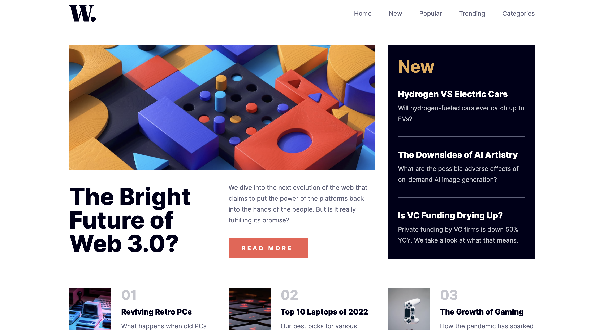

# Frontend Mentor - News homepage solution

This is a solution to the [News homepage challenge on Frontend Mentor](https://www.frontendmentor.io/challenges/news-homepage-H6SWTa1MFl). Frontend Mentor challenges help you improve your coding skills by building realistic projects.

## Table of contents

- [Overview](#overview)
  - [The challenge](#the-challenge)
  - [Screenshot](#screenshot)
  - [Links](#links)
- [My process](#my-process)
  - [Built with](#built-with)
  - [What I learned](#what-i-learned)
  - [Useful resources](#useful-resources)
- [Author](#author)

## Overview

### The challenge

Users should be able to:

- View the optimal layout for the interface depending on their device's screen size
- See hover and focus states for all interactive elements on the page

### Screenshot




### Links

- Solution URL: [https://www.frontendmentor.io/solutions/news-homepage-react-js-SFg17hwIln]
- Live Site URL: [https://lucky-torrone-73d729.netlify.app/]

## My process

### Built with

- Semantic HTML5 markup
- CSS custom properties
- Flexbox
- JavaScript
- Mobile-first workflow
- [React](https://reactjs.org/) - JS library

### What I learned

I learned more about React hooks, in particular useEffect and useState, which I used to control the nav slider I created for mobile devices. I used useState to set open and close menu states, and used useEffect to close the mobile menu when the screen was resized to 768px and above to prevent the menu from being open when the window was resized to below 768px.

```js
const [navOpen, setNavOpen] = useState(false);

const openMenu = () => {
  setNavOpen(true);
};

useEffect(() => {
  const handleResize = () => {
    if (window.innerWidth >= 768) {
      setNavOpen(false);
    }
  };

  window.addEventListener("resize", handleResize);

  return () => {
    window.removeEventListener("resize", handleResize);
  };
}, []);

useEffect(() => {
  document.body.style.overflow = navOpen ? "hidden" : "auto";
}, [navOpen]);
```

### Useful resources

- [https://react.dev] - The React docs are a fantastic resource you can use to learn React.
- [https://scrimba.com/learn/learnreact] - Scrimba has an awesome free course on React by Bob Ziroll [https://twitter.com/bobziroll]

## Author

- Website - [Add your name here](https://www.your-site.com)
- Frontend Mentor - [@jake4369](https://www.frontendmentor.io/profile/jake4369)
- Twitter - [@jakexcode](https://www.twitter.com/jakexcode)
