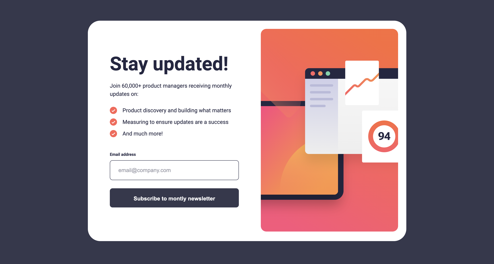

# Frontend Mentor - Newsletter sign-up form with success message solution

This is a solution to the [Newsletter sign-up form with success message challenge on Frontend Mentor](https://www.frontendmentor.io/challenges/newsletter-signup-form-with-success-message-3FC1AZbNrv). Frontend Mentor challenges help you improve your coding skills by building realistic projects.

## Table of contents

- [Overview](#overview)
  - [The challenge](#the-challenge)
  - [Screenshot](#screenshot)
  - [Links](#links)
- [My process](#my-process)
  - [Built with](#built-with)
  - [What I learned](#what-i-learned)
  - [Useful resources](#useful-resources)
- [Author](#author)

## Overview

### The challenge

Users should be able to:

- Add their email and submit the form
- See a success message with their email after successfully submitting the form
- See form validation messages if:
  - The field is left empty
  - The email address is not formatted correctly
- View the optimal layout for the interface depending on their device's screen size
- See hover and focus states for all interactive elements on the page

### Screenshot



### Links

- Solution URL: [https://www.frontendmentor.io/solutions/newsletter-sign-up-form-with-success-message-lus6oawiuQ]
- Live Site URL: [https://666d7bc9a47b0ad2c1485536--luminous-begonia-0ccc67.netlify.app/]

## My process

### Built with

- Semantic HTML5 markup
- CSS custom properties
- Flexbox
- CSS Grid
- Mobile-first workflow
- [React](https://reactjs.org/) - JS library

### What I learned

In this challenge I learned basic routing using react-router-dom to set up different routes for the sign up page and the success page, as well as protecting routes. I used a protected route to prevent the user from accessing the success message before they have signed up, redirecting them to the form if they try to access the /success route.

I also had to use the useContext hook to allow use of the email address inside different non-related components.

To see how you can add code snippets, see below:

```jsx
import { createBrowserRouter, RouterProvider } from "react-router-dom";

const router = createBrowserRouter([
  {
    path: "/",
    element: <App />,
  },
  {
    path: "/success",
    element: (
      <ProtectedRoute>
        <Success />
      </ProtectedRoute>
    ),
  },
]);

const root = ReactDOM.createRoot(document.getElementById("root"));
root.render(
  <React.StrictMode>
    <EmailProvider>
      <RouterProvider router={router} />
    </EmailProvider>
  </React.StrictMode>
);
```

```jsx
import React, { createContext, useState } from "react";

export const EmailContext = createContext();

export const EmailProvider = ({ children }) => {
  const [email, setEmail] = useState("");

  return (
    <EmailContext.Provider value={{ email, setEmail }}>
      {children}
    </EmailContext.Provider>
  );
};
```

### Useful resources

- [https://react.dev/] - Official React docs.
- [https://reactrouter.com/en/main] - React Router website

## Author

- Frontend Mentor - [@jake4369](https://www.frontendmentor.io/profile/jake4369)
- Twitter - [@jakexcode](https://www.twitter.com/jakexcode)
