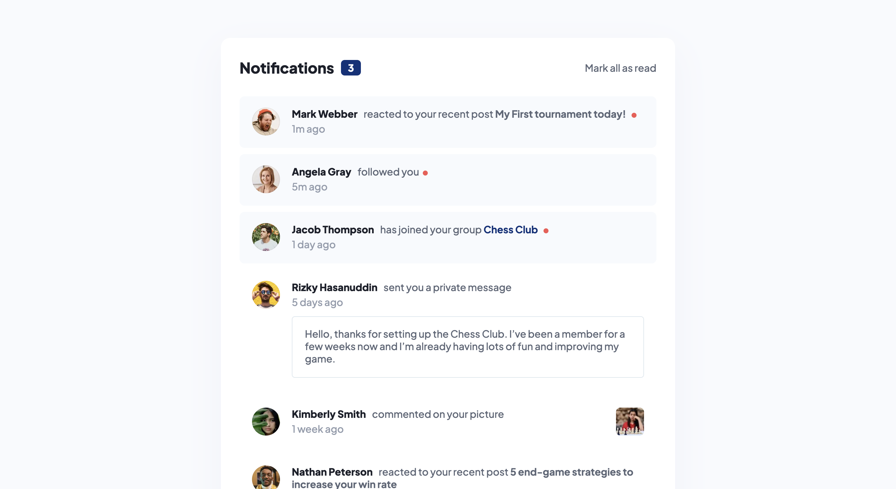

# Frontend Mentor - Notifications page solution

This is a solution to the [Notifications page challenge on Frontend Mentor](https://www.frontendmentor.io/challenges/notifications-page-DqK5QAmKbC). Frontend Mentor challenges help you improve your coding skills by building realistic projects.

## Table of contents

- [Overview](#overview)
  - [The challenge](#the-challenge)
  - [Screenshot](#screenshot)
  - [Links](#links)
- [My process](#my-process)
  - [Built with](#built-with)
  - [What I learned](#what-i-learned)
  - [Continued development](#continued-development)
  - [Useful resources](#useful-resources)
- [Author](#author)

## Overview

### The challenge

Users should be able to:

- Distinguish between "unread" and "read" notifications
- Select "Mark all as read" to toggle the visual state of the unread notifications and set the number of unread messages to zero
- View the optimal layout for the interface depending on their device's screen size
- See hover and focus states for all interactive elements on the page

### Screenshot



### Links

- Solution URL: [Add solution URL here](https://your-solution-url.com)
- Live Site URL: [Add live site URL here](https://your-live-site-url.com)

## My process

### Built with

- Semantic HTML5 markup
- CSS custom properties
- Flexbox
- Mobile-first workflow

### What I learned

In the challenge I learned more about handling click events using JavaScript which I used to update the number of notifications and also used to toggle CSS classes.

```js
notifications.forEach((notification) => {
  notification.addEventListener("click", () => {
    if (notification.classList.contains("notification-component_pm")) {
      notificationsTotal.textContent = !privateMessage.classList.contains(
        "unread"
      )
        ? Number(notificationsTotal.textContent) + 1
        : Number(notificationsTotal.textContent) - 1;

      privateMessage.classList.toggle("unread");
    } else {
      notificationsTotal.textContent = !notification.classList.contains(
        "unread"
      )
        ? Number(notificationsTotal.textContent) + 1
        : Number(notificationsTotal.textContent) - 1;

      notification.classList.toggle("unread");
    }
  });
});
```

### Continued development

I would like to re-do this challenge using React Js

### Useful resources

- [https://developer.mozilla.org/en-US/docs/Web/API/EventTarget/addEventListener] - MDN is a great site to learn more about EnentTarget.addEventLister()

## Author

- Frontend Mentor - [@jake4369](https://www.frontendmentor.io/profile/jake4369)
- Twitter - [@jakexcode](https://www.twitter.com/jakexcode)
